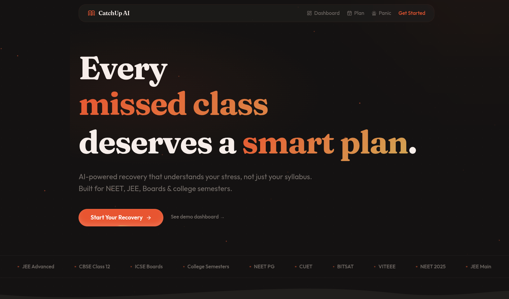

# CatchUp AI (#AMUHACKS5.0 #CSSAMU #CSDAMU #AMU)

**AI-powered academic recovery for Indian students**



CatchUp AI helps students who've fallen behind due to illness, burnout, or personal issues get back on track with personalized triage analysis, empathetic AI guidance with voice support, and adaptive 14-day recovery plans.

---

## Problem

Every year, millions of Indian students preparing for NEET, JEE, CBSE/ICSE boards, and college semesters fall behind due to health issues, family emergencies, or mental health struggles. When they try to return, they face:

- **Overwhelming syllabus backlog** with no clear starting point
- **Crippling anxiety** that makes productive study impossible
- **Generic advice** from tutors/apps that doesn't account for their specific situation
- **No emotional support** integrated into the recovery process

## Solution

CatchUp AI provides a complete academic recovery experience:

1. **Panic Mode Triage** -- AI analyzes the student's situation, provides empathetic voice-guided support (Cartesia TTS), and triages subjects by urgency
2. **Smart Recovery Plans** -- Groq-powered 14-day plans with survival/thriving modes, adapting to exam type and subject priorities
3. **Progress Dashboard** -- Real-time tracking of recovery with visual analytics

## Tech Stack

| Layer | Technology | Purpose |
|-------|-----------|---------|
| **Framework** | Next.js 16 (App Router) | Full-stack React framework |
| **Frontend** | React 19, TypeScript 5 | UI with type safety |
| **Styling** | Tailwind CSS 4, shadcn/ui, Magic UI | Custom "Ember" design system |
| **State** | Zustand 5 (persist) | Client-side state management |
| **AI/LLM** | Groq (Llama 3.3 70B) | Triage analysis & plan generation |
| **Voice** | Cartesia (Sonic 2) | Empathetic text-to-speech |
| **Database** | PostgreSQL + Prisma | User sessions, plans, progress |
| **Animation** | Framer Motion | Page transitions & micro-interactions |
| **Charts** | Recharts | Dashboard analytics |

## Architecture

```
src/
├── app/
│   ├── api/
│   │   ├── triage/         # POST: Groq triage + Cartesia TTS
│   │   ├── tts/            # POST: Text-to-speech generation
│   │   ├── plan/generate/  # POST: Groq 14-day plan generation
│   │   ├── progress/       # GET/POST: Task completion tracking
│   │   └── user/           # GET/POST: Session management
│   ├── dashboard/          # Recovery analytics & charts
│   ├── onboarding/         # 3-step context wizard
│   ├── panic-mode/         # AI triage + voice + breathing exercise
│   └── plan/               # 14-day recovery plan with checkboxes
├── components/
│   ├── logo.tsx            # Custom SVG logo
│   └── ui/                 # 29 shadcn/Magic UI components
├── lib/
│   ├── services/
│   │   ├── groq.ts         # Groq SDK integration
│   │   ├── cartesia.ts     # Cartesia TTS integration
│   │   └── db.ts           # Prisma database helpers
│   ├── store.ts            # Zustand store
│   ├── types.ts            # TypeScript interfaces
│   ├── constants.ts        # Exam configs & mappings-
└── prisma/
    └── schema.prisma       # Database schema
```

## Getting Started

### Prerequisites

- Node.js 18+
- PostgreSQL
- Groq API key ([console.groq.com](https://console.groq.com))
- Cartesia API key ([play.cartesia.ai](https://play.cartesia.ai))

### Setup

```bash
# Install dependencies
npm install

# Set up environment variables
cp .env.example .env
# Edit .env with your API keys and database URL

# Set up the database
npx prisma generate
npx prisma db push

# Run development server
npm run dev
```

Open [http://localhost:3000](http://localhost:3000) to start.

### Environment Variables

| Variable | Description |
|----------|-------------|
| `DATABASE_URL` | PostgreSQL connection string |
| `GROQ_API_KEY` | Groq API key for Llama 3.3 70B |
| `CARTESIA_API_KEY` | Cartesia API key for Sonic 2 TTS |
| `CARTESIA_VOICE_ID` | Voice ID for TTS (optional, has default) |

## Team

**Runtime Terror** -- AMU Hacks 5.0


Leader: Adeeba Ekbal

Team Member: Arsh Javed
